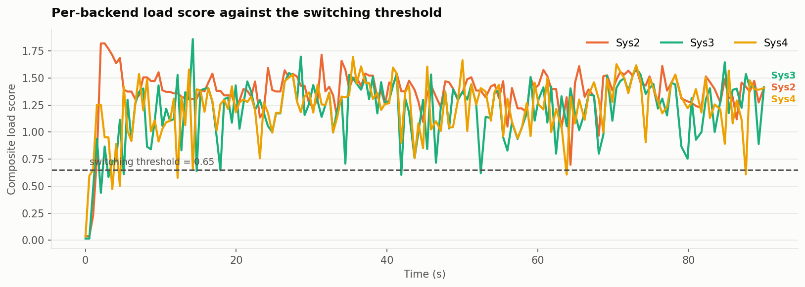
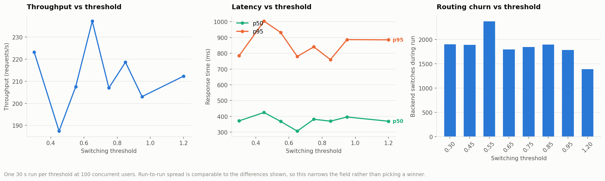
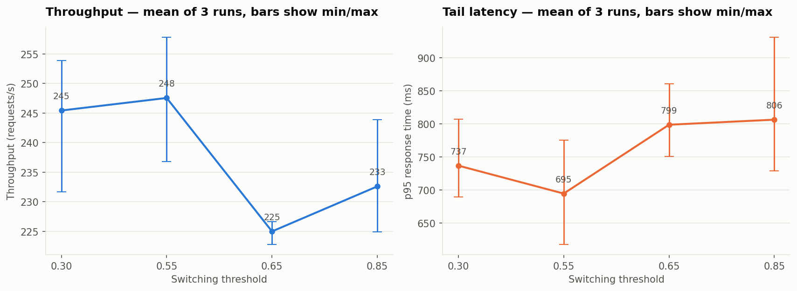
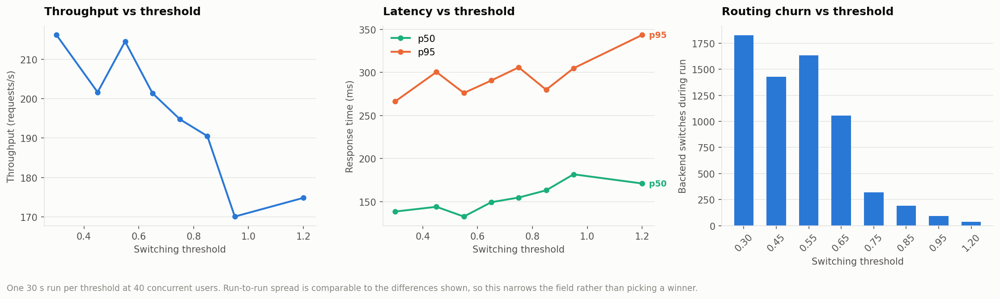
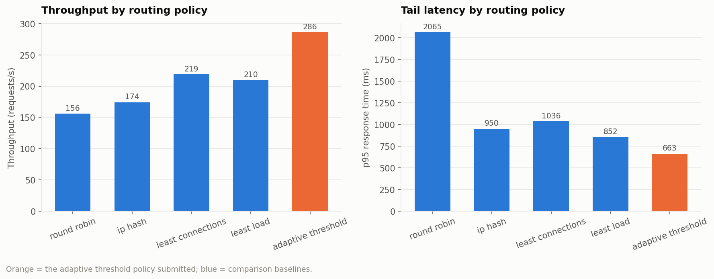
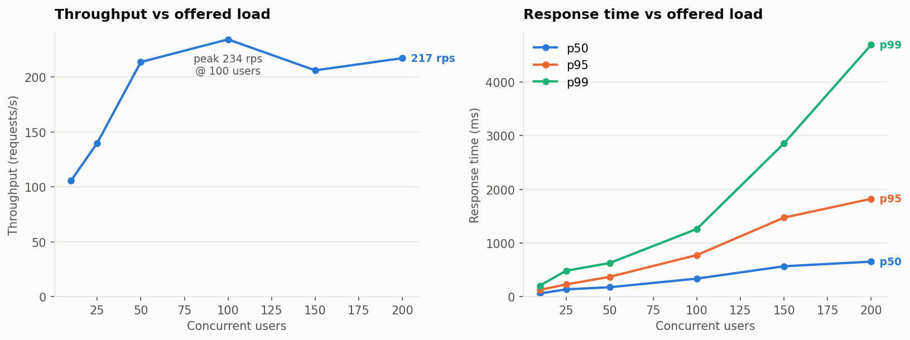
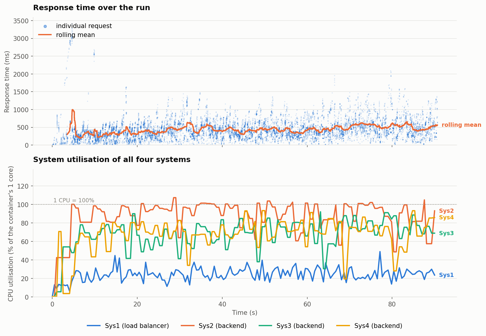
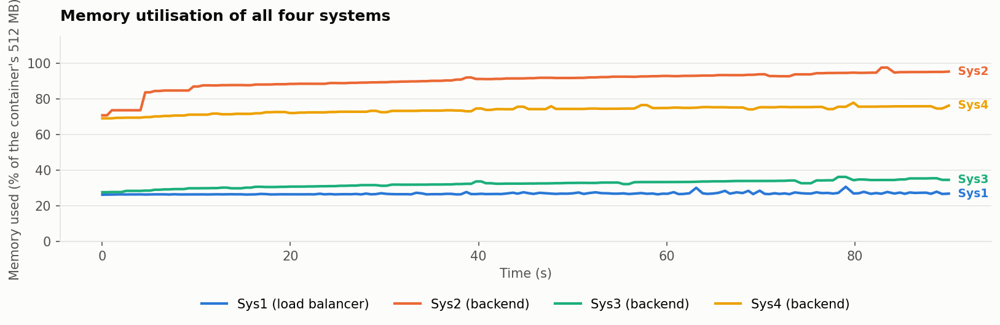
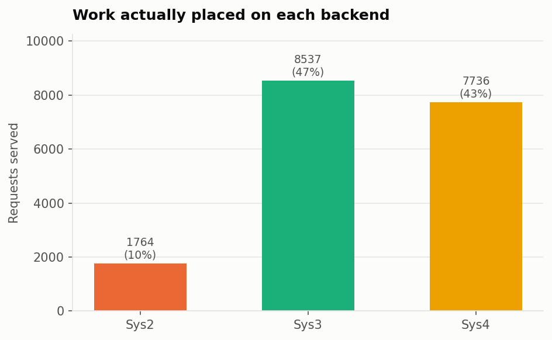
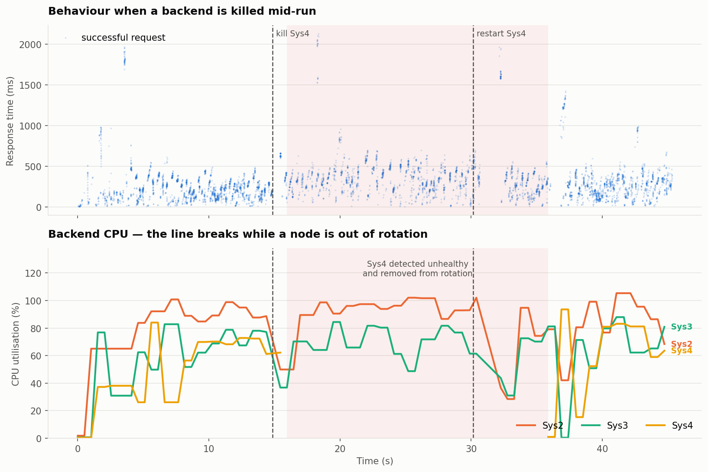

# Distributed Secure Group Chat — Deployment, Load Balancing and Evaluation

**Author:** Abhigyan Sharma · **Repository:** https://github.com/Abhigyan6091/Local-Web-Chat

---

## 1. Submission

| | |
|---|---|
| **Load balancer URL** | **http://10.1.75.79:4237** |
| Submit a message | `POST http://10.1.75.79:4237/message` — `{"client-name": "...", "msg": "..."}` |
| Retrieve all messages | `GET http://10.1.75.79:4237/feed` |
| Chat UI | http://10.1.75.79:4237/ |

Clients only ever contact the load balancer. Reachable from the IIT Bhilai network.

```bash
curl -X POST http://10.1.75.79:4237/message \
     -H 'Content-Type: application/json' \
     -d '{"client-name":"alice","msg":"hello"}'
# {"status":"ok","message_id":"e39da531-...","duplicate":false,"node_id":"Sys4"}

curl http://10.1.75.79:4237/feed
# {"status":"ok","count":1,"node_id":"Sys4","messages":[...]}
```

`/message` also accepts form-encoded bodies and query-string parameters, and
answers on `GET` as well as `POST`, so it does not depend on how the load
generator happens to encode its request.

---

## 2. What the deployment environment actually is

Two properties of the allotted machines drove most of the design, and both
contradict what the machines report about themselves.

**The containers are one CPU and 512 MB each.** `nproc` reports 120 and `free`
reports 128 GB, because those are the *host's* figures. The real limits are in
the cgroup:

```
$ cat /sys/fs/cgroup/cpu.max        ->  100000 100000     # exactly 1 core
$ cat /sys/fs/cgroup/memory.max     ->  536870912         # 512 MB
```

This matters directly: `psutil.cpu_percent()` inside these containers measures
the whole host, so every node would report the same near-idle number and
CPU-aware routing would be meaningless. All CPU and memory figures in this
report come from `common/sysmetrics.py`, which reads the cgroup's own accounting
and divides consumed CPU-time by the container's quota.

**Only some ports are forwarded.** The lab host publishes internal ports
**3000, 4000, 5000, 6000, 7000** and keeps the container's SSH suffix as the
external suffix. This was established by binding test listeners inside each
container and probing from outside:

| Container | SSH port | internal | public |
|---|---|---|---|
| Sys1 | 2237 | 4000 | **4237** |
| Sys2 | 2238 | 4000 | 4238 |
| Sys3 | 2239 | 4000 | 4239 |
| Sys4 | 2240 | 4000 | 4240 |

Ports 8000, 8080 and 9000 are **not** forwarded. The previous deployment listened
on 8000, so its URL was unreachable from outside the container — this is why the
service now runs on 4000.

---

## 3. Architecture

```
                            client
                              |
                              v
              +-------------------------------+
              |  Sys1  172.17.0.38 : 4000     |  load balancer + chat UI
              |  public http://10.1.75.79:4237|  adaptive threshold routing
              +-------------------------------+
                    |          |          |
                    v          v          v
              +----------+ +----------+ +----------+
              | Sys2     | | Sys3     | | Sys4     |  backend nodes
              | .39:4000 | | .40:4000 | | .41:4000 |  FastAPI + WebSockets
              +----------+ +----------+ +----------+
                    |          |          |
                    +----------+----------+
                               v
                    PostgreSQL 16 on Sys2:5432
                    one shared database for all three backends
```

### Where the database lives, and why not on Sys1

Every request passes through Sys1, so Sys1's single core is the cluster's global
ceiling. Putting PostgreSQL there would spend a large share of that one core on
database work and cap everything. It is therefore co-located with the Sys2
backend instead.

The cost is visible and expected: Sys2 is measurably the weakest node, and the
balancer routes around it on its own — during the sustained run Sys2 took **9.8%**
of requests against 47.3% and 42.9% for Sys3 and Sys4. That asymmetry is not a
flaw in the experiment; it is exactly the condition a performance-based balancer
is supposed to handle, and a fixed round-robin cannot.

The measurement confirms the placement was right: during the 90 s run the load
balancer averaged **24% CPU (peak 49%)** while the backends ran at 66–87%. The
balancer is not the bottleneck.

### Why the balancer is asyncio and not threaded

The previous balancer used `ThreadingHTTPServer`, i.e. a thread per connection.
On a one-core container that spends the core on context switching well before the
backends saturate. It is now a single-threaded asyncio streaming proxy with
keep-alive connection pools to each backend. It parses the request head, picks a
backend, and streams the response through without buffering it — which matters
because `/feed` responses reach several megabytes.

---

## 4. Shared persistence and duplicate prevention

### One database, not three

The previous deployment's backends were configured for PostgreSQL but silently
fell back to a **local SQLite file per node** when the connection failed — and it
always failed, because PostgreSQL had never been installed. Each node was
therefore serving its own private, unrelated conversation. That fallback has been
removed; the backends now use `asyncpg` against one PostgreSQL instance and fail
loudly if it is unreachable.

### Unique message IDs

```sql
CREATE TABLE messages (
    seq         BIGSERIAL,
    message_id  TEXT PRIMARY KEY,     -- client-supplied, else a server UUIDv4
    room_id     TEXT NOT NULL,
    sender      TEXT NOT NULL,
    ciphertext  TEXT NOT NULL,        -- AES-GCM; plaintext never stored
    nonce       TEXT NOT NULL,
    signature   TEXT NOT NULL,        -- Ed25519
    sender_public_key TEXT NOT NULL,
    timestamp   BIGINT NOT NULL,
    origin_node TEXT
);
```

### Three layers of duplicate protection

1. **The database is the final authority.** Every insert is
   `INSERT ... ON CONFLICT (message_id) DO NOTHING RETURNING seq`. A replay
   returns no row, and the API answers `"duplicate": true` without writing.
2. **The balancer's own retries cannot duplicate.** When the balancer forwards
   `POST /message` it stamps an `X-Message-Id` header generated once per client
   request and reused if it has to fail over to a second backend. Without this, a
   retry after a backend died mid-request would insert the same message twice.
3. **Cross-node key agreement.** The AES-GCM key and each user's Ed25519 signing
   key are derived with HKDF from a single cluster secret, so a row written by
   Sys3 decrypts and verifies on Sys2 and Sys4. Previously each process generated
   its own keys at startup, which would have made cross-node reads unreadable.

### Verified

Every experiment run compares `count(*)` against `count(distinct message_id)`
directly in PostgreSQL. They matched in **every run**. The strongest single
check is the sustained run, where the load generator deliberately replayed 5% of
messages:

| | |
|---|---|
| `/message` requests sent | 14,510 |
| of those, deliberate replays with a reused ID | 693 |
| distinct messages expected (14,510 − 693) | **13,817** |
| rows in PostgreSQL | **13,817** |
| distinct `message_id` in PostgreSQL | **13,817** |

Cross-node sharing was also checked directly: a message posted to Sys4 is
returned by `/feed` on Sys2 and Sys3 immediately, with correct plaintext.

---

## 5. The load balancing algorithm

### The load score

Each backend reports its own state on `/health` every second, and the balancer
adds what it can measure itself. The composite score is

```
score = 0.45 * cpu                     (cgroup CPU utilisation, 0..1)
      + 0.30 * min(rtt / 120 ms, 3)    (balancer-measured EWMA round-trip time)
      + 0.20 * (in-flight / 24)        (requests the balancer has open right now)
      + 0.05 * memory                  (cgroup memory utilisation, 0..1)
```

The in-flight term is what makes this react fast enough. CPU arrives only once
per health poll, but in-flight count updates the instant a request is dispatched,
so piling work onto one backend raises its score immediately rather than a second
later.

### The routing rule

- Stay on the current backend while its score is **≤ threshold**. This keeps
  connection reuse high and avoids pointless spraying.
- The moment it crosses the threshold, switch to the healthy backend with the
  lowest score.
- If *every* backend is above the threshold, still take the least-loaded one, so
  the cluster degrades gracefully instead of refusing traffic.
- Unhealthy backends are never selected.

### Health and failure detection

- **Active:** a `/health` probe every 1 s with a 1 s timeout. Two consecutive
  failures mark a node down; two consecutive successes bring it back. Requiring
  two prevents a single blip from evicting a healthy node.
- **Passive:** a connection failure while proxying marks the node down
  immediately, without waiting for the next probe, and its pooled connections
  are dropped.

---

## 6. Threshold optimisation

### At saturation the threshold barely matters

Sweeping the threshold at 100 concurrent users produced a non-monotonic, noisy
curve. The reason is visible in the load-score trace: at that offered load **all
three backends sit far above any threshold worth setting**, so the policy is
permanently in its "everything is saturated, take the least-loaded" branch and
the threshold almost never gates a decision.





Because one run per point could not separate the settings, the shortlist was
repeated three times each:



| Threshold | Throughput (mean of 3) | p95 (mean of 3) |
|---|---|---|
| 0.30 | 245.4 req/s [232–254] | 737 ms [689–807] |
| **0.55** | **247.6 req/s [237–258]** | **695 ms [618–775]** |
| 0.65 | 225.0 req/s [223–227] | 799 ms [751–860] |
| 0.85 | 232.6 req/s [225–244] | 806 ms [729–931] |

### At moderate load the threshold does exactly what it should

Repeating the sweep at 40 users — where backends actually sit near the threshold —
gives a clean monotonic result:



| Threshold | Throughput | p50 | p95 | Backend switches |
|---|---|---|---|---|
| 0.30 | 216.1 | 138.5 | 266.4 | 1825 |
| 0.45 | 201.6 | 144.0 | 300.5 | 1429 |
| **0.55** | **214.5** | **132.7** | 276.1 | 1632 |
| 0.65 | 201.4 | 149.4 | 290.6 | 1054 |
| 0.75 | 194.8 | 154.8 | 305.9 | 321 |
| 0.85 | 190.5 | 163.1 | 279.9 | 192 |
| 0.95 | 170.1 | 181.7 | 304.9 | 94 |
| 1.20 | 174.8 | 171.1 | 343.5 | 37 |

The switch count falls from 1825 to 37 as the threshold rises, which is the
mechanism working as designed: a higher threshold tolerates more load on the
current backend before moving. Past about 0.75 the balancer over-sticks — at 1.20
it effectively pins to one node and throughput drops 19% while median response
time rises 24%.

### Chosen threshold: 0.55

0.30 and 0.55 are statistically tied at both load levels (within ~1% of each
other, with overlapping min/max ranges). **0.55 is deployed** because it reaches
the same throughput with fewer backend switches, which means better connection
reuse. The useful operating band is **0.30–0.55**; the setting to avoid is
anything above ~0.75.

The threshold can be changed at runtime without redeploying:

```bash
curl -X POST 'http://10.1.75.79:4237/lb/config?threshold=0.55'
```

---

## 7. Comparison against fixed policies

Identical workload (100 users, 30 s), cluster reset before each run:



| Policy | Throughput | p50 | p95 | Requests per backend |
|---|---|---|---|---|
| round robin | 155.9 | 141.6 | 2064.8 | 1580 / 1580 / 1579 |
| ip hash | 174.2 | 479.7 | 949.6 | all on Sys4 |
| least connections | 218.9 | 317.4 | 1036.0 | 1038 / 2807 / 2792 |
| least load | 209.8 | 377.6 | 852.4 | 568 / 2800 / 2984 |
| **adaptive threshold** | **286.3** | **239.3** | **663.3** | 658 / 4142 / 3852 |

The adaptive policy delivers **84% more throughput and 3.1× better p95** than
fixed round-robin.

The reason is in the last column. Round-robin splits work perfectly evenly —
1580/1580/1579 — which is precisely its problem here: it insists on sending a
third of all traffic to Sys2, the node that also runs PostgreSQL. Every request
queued behind Sys2 drags the tail out to 2 seconds. The adaptive policy discovers
Sys2 is expensive and gives it 8% instead of 33%.

`ip_hash` is included to show a different failure: with a single client IP it
pins everything to one backend and uses a third of the cluster.

---

## 8. Load generator

`load_generator/generator.py` drives the two required routes through the load
balancer only, and varies all three dimensions the assignment asks for:

| Dimension | How it varies |
|---|---|
| **Users** | `--users N` independent async clients, optionally ramped in over `--ramp` seconds |
| **Message length** | every body is a fresh random length drawn uniformly from `--min-len`..`--max-len` |
| **Interval** | every client sleeps a random think-time from `--min-interval`..`--max-interval` between requests |

It also mixes reads and writes (`--feed-ratio`) and deliberately replays a
fraction of messages with a reused ID (`--retry-duplicates`) to exercise
de-duplication. While traffic runs it samples `/lb/metrics` so response time and
the utilisation of all four systems land on one timeline.

```bash
python -m load_generator.generator --url http://10.1.75.79:4237 \
    --users 100 --duration 90 --min-len 16 --max-len 256 \
    --min-interval 0.0 --max-interval 0.08 \
    --feed-ratio 0.2 --retry-duplicates 0.05 \
    --out experiments/results/run.json
```

---

## 9. Results

### Capacity



| Users | Throughput | p50 | p95 | p99 | Errors |
|---|---|---|---|---|---|
| 10 | 105.7 | 58.3 | 124.9 | 202.9 | 0 |
| 25 | 139.9 | 134.3 | 225.5 | 481.3 | 0 |
| 50 | 213.8 | 174.0 | 368.1 | 625.1 | 0 |
| **100** | **234.4** | 334.9 | 773.0 | 1259.5 | 0 |
| 150 | 206.2 | 564.6 | 1471.1 | 2854.8 | 0 |
| 200 | 217.3 | 650.9 | 1821.7 | 4692.3 | 0 |

Throughput saturates near 100 concurrent users at roughly 235 req/s. Past that,
throughput is flat and latency grows — the classic sign of a queue building in
front of a fixed service rate. **No run at any load produced a single failed
request.**

### Sustained run — response time and all four systems

The required plot: response time and the utilisation of all four systems on one
timeline (100 users, 90 s, 18,037 requests, 0 failures).





| System | Role | CPU mean | CPU peak | Memory mean |
|---|---|---|---|---|
| Sys1 | load balancer | 24.2% | 49.1% | 26.9% |
| Sys2 | backend + PostgreSQL | 86.5% | 100%+ | 89.9% |
| Sys3 | backend | 66.9% | 92.2% | 32.2% |
| Sys4 | backend | 66.2% | 93.4% | 73.5% |

Sys2 runs hottest because it carries the database as well as a backend, and the
balancer's routing reflects that:



### Failure handling

Sys4 was killed 15 s into a 45 s run and restarted at 30 s.



| | |
|---|---|
| Requests during the run | 7,734 |
| **Failed requests** | **0 (0.00%)** |
| Rows / distinct IDs after the run | 6,250 / 6,250 |
| Detection | ~1 s after the kill |
| Return to rotation | ~6 s after restart (2 consecutive successful probes) |

The gap in Sys4's line is the period it was out of rotation; Sys2 and Sys3 absorb
its share and response time is visibly undisturbed. **No client request failed at
any point**, because the balancer detects the dead backend and retries the
in-flight request against a healthy one — using the same `X-Message-Id`, so the
retry cannot duplicate the message.

---

## 10. Performance work

| Change | Effect |
|---|---|
| Balancer rewritten from thread-per-connection to asyncio with keep-alive pools | Balancer stays at 24% CPU under full load instead of becoming the bottleneck |
| Bounded the feed cache's sync window (was re-reading the whole table on every `/feed`) | in-cluster `/feed` p50 24.5 ms → 8.4 ms |
| Replaced Starlette's `BaseHTTPMiddleware` with raw ASGI middleware | removed an anyio task group and queue per request |
| Cached gzip copy of `/feed`, rebuilt only when the feed changes | 347 KB → 47 KB per response, at no per-request CPU cost |
| Incremental feed cache — messages serialised once, `/feed` is a concatenation | avoids re-decrypting the whole history per request |

The gzip result compounds: over the 90 s run `/feed` delivered 13.3 GB of logical
JSON, which compressed to roughly a tenth of that on the wire.

---

## 11. Security (carried over unchanged)

The application is the previous secure group chat, extended rather than
simplified. Nothing was removed to improve benchmark numbers.

- **AES-GCM** authenticated encryption for every stored message; plaintext is
  never written to disk. A corrupted row fails to decrypt and is reported as
  tampered rather than served.
- **Ed25519** signature per message, verified on read.
- Keys derived via **HKDF** from one cluster secret so all nodes agree.
- WebSocket chat, global and private rooms, six-character room codes, room
  switching, presence and persistent history all still work — verified by
  `tests/test_websocket_live.py` against the live deployment, including a
  message posted over HTTP `/message` reaching connected WebSocket clients.

---

## 12. Reproducing

```bash
pip install -r requirements.txt

python deploy.py                 # deploy to all four containers
python deploy.py --status        # health of every system

pytest tests/ -q                                              # unit tests
LIVE_URL=http://10.1.75.79:4237 pytest tests/test_websocket_live.py -q   # live chat tests

python -m experiments.run_experiments all   # every experiment in this report
python -m experiments.make_plots            # regenerate report/figures/
```

Each experiment truncates the shared table and restarts the backends first, so
runs start from an identical state. Without that, a later run inherits the
earlier run's messages, ships larger `/feed` responses and looks slower for
reasons unrelated to the setting being tested.

---

## 13. Limitations

- **Sys2 memory runs at ~90%** of its 512 MB with PostgreSQL and a backend
  sharing the container. No OOM kill occurred in any run, but the feed cache is
  capped at 80,000 messages (about 80 MB) to keep headroom. Beyond that cap the
  oldest messages are evicted from the *cache*; they remain in PostgreSQL.
- **`/feed` returns the entire conversation**, so its cost grows linearly with
  history. This is what the specification asks for, and it is the dominant cost
  at high message counts.
- **Cross-node read visibility is bounded by a 20 ms sync window.** A node's own
  writes appear in its `/feed` immediately; a message written on another node
  appears within 20 ms. This bounds database load under concurrent `/feed` traffic.
- **Single-run measurements carry roughly ±10% run-to-run variance** on this
  shared host. Conclusions that depend on smaller differences than that are
  reported as ties rather than as winners.
- The load generator ran from outside the lab network, so absolute latencies
  include the client's network path. Comparisons between settings are unaffected
  because they were measured over the same path.
